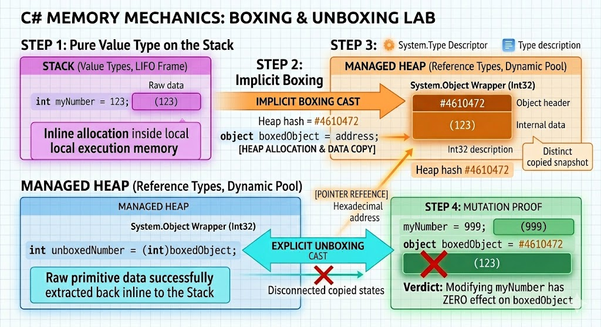

`dotnet BoxingVsUnboxing.cs` -> run this file to help visualize `boxing` and `unboxing`

```csharp
using System;
using System.Runtime.CompilerServices;

namespace BoxingUnboxingLab
{
    class Program
    {
        static void Main()
        {
            // --- STEP 1: THE LOCAL VALUE ---
            Console.ForegroundColor = ConsoleColor.Magenta;
            Console.WriteLine("=== STEP 1: Pure Value Type on the Stack ===");
            int myNumber = 123;
            
            Console.WriteLine($" [Stack Frame Block] myNumber ──> ({myNumber})");
            Console.WriteLine(" Location: Lives entirely inline inside local execution memory.");
            Console.ResetColor();

            // --- STEP 2: THE BOXING OPERATION ---
            Console.ForegroundColor = ConsoleColor.DarkYellow;
            Console.WriteLine("\n=== STEP 2: Implicit Boxing ===");
            
            // Boxing occurs here
            object boxedObject = myNumber; 
            
            Console.WriteLine($" [Stack Variable]  myNumber    ──({myNumber})──> [BOXING CAST] ──┐");
            Console.WriteLine($"                                                            │");
            Console.WriteLine($" [Heap Allocation] boxedObject <──[Pointer Address]─────────┘");
            Console.WriteLine($"                   └──> Internal Wrapped Data Value: ({boxedObject})");
            Console.WriteLine($"                   └──> Heap System Object Identity: #{RuntimeHelpers.GetHashCode(boxedObject)}");
            Console.ResetColor();

            // --- STEP 3: THE UNBOXING OPERATION ---
            Console.ForegroundColor = ConsoleColor.Cyan;
            Console.WriteLine("\n=== STEP 3: Explicit Unboxing ===");
            
            // Unboxing occurs here
            int unboxedNumber = (int)boxedObject; 
            
            Console.WriteLine($" [Heap Reference]  boxedObject   ──(ID: #{RuntimeHelpers.GetHashCode(boxedObject)})──┐");
            Console.WriteLine($"                                                                  │");
            Console.WriteLine($"                                 ┌──[UNBOXING EXPLICIT CAST]──────┘");
            Console.WriteLine($"                                 ▼");
            Console.WriteLine($" [Stack Location]  unboxedNumber ──> ({unboxedNumber})");
            Console.WriteLine(" Status: Raw primitive data successfully extracted back inline to the Stack.");
            Console.ResetColor();

            // --- STEP 4: THE MUTATION TRAP ---
            Console.ForegroundColor = ConsoleColor.Green;
            Console.WriteLine("\n=== STEP 4: Proof of Disconnected Copied States ===");
            myNumber = 999; // Mutate original local stack variable
            
            Console.WriteLine($" Mutated Local Stack Variable (myNumber)     ──> ({myNumber})");
            Console.WriteLine($" Isolated Heap Envelope Object (boxedObject) ──> ({boxedObject}) [ID: #{RuntimeHelpers.GetHashCode(boxedObject)}]");
            Console.WriteLine("\n[Verdict]:");
            Console.WriteLine(" Notice that changing 'myNumber' did NOT change the value inside 'boxedObject'.");
            Console.WriteLine(" The arrows do not link them interactively; boxing created a distinct duplicate snapshot.");
            Console.ResetColor();
        }
    }
}
```