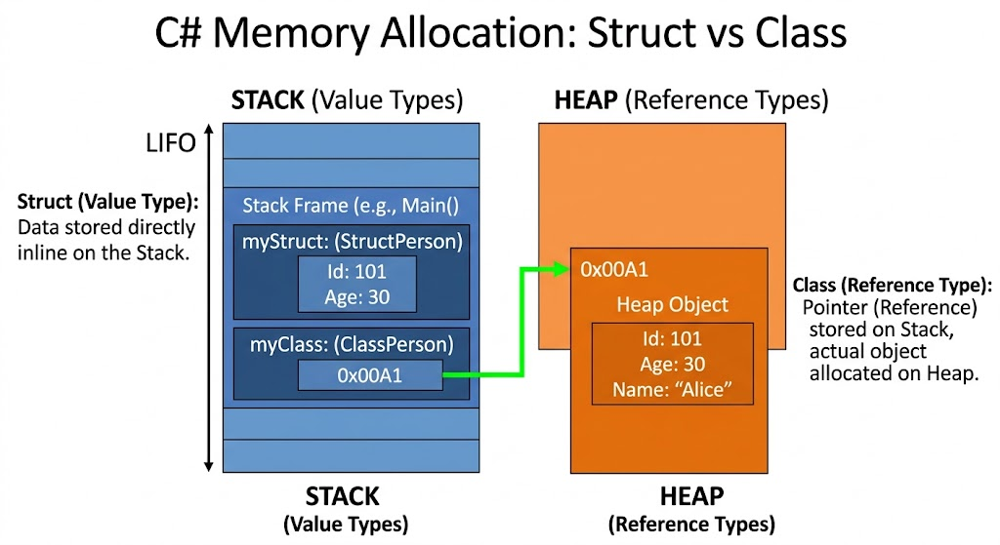

```csharp
using System;
using System.Runtime.CompilerServices;

namespace MemoryMechanicsLab
{
    public struct StackDemo
    {
        public string Text { get; set; }
    }
    public class HeapDemo
    {
        public string Text {get; set;}
    }
    class Program
    {
        static void Main()
        {
            // --- STEP 1: INITIALIZATION ---
            Console.WriteLine();
            Console.ForegroundColor = ConsoleColor.Magenta;
            Console.WriteLine("=== STEP 1: Initializing Struct (Value Type) ===");
            StackDemo stackDemo1 = new() { Text = "First Text" };

            Console.WriteLine($"[Stack Allocation] stackDemo1.Text ──> \"{stackDemo1.Text}\"");
            Console.WriteLine($"Memory Location Identity ID      ──> #{RuntimeHelpers.GetHashCode(stackDemo1)}");
            Console.ResetColor();

            // --- STEP 2: ASSIGNMENT ---
            Console.ForegroundColor = ConsoleColor.DarkYellow;
            Console.WriteLine("\n=== STEP 2: Assigning stackDemo2 = stackDemo1 ===");
            StackDemo stackDemo2 = stackDemo1; // Direct bitwise copy

            Console.WriteLine($"[Value-Type Copy]  stackDemo2.Text ──> \"{stackDemo2.Text}\"");
            Console.WriteLine($"Memory Location Identity ID      ──> #{RuntimeHelpers.GetHashCode(stackDemo2)}");
            Console.ResetColor();

            Console.WriteLine("\n[Observation]: Data matches, but notice the Identity IDs are different from the start!");
            Console.WriteLine($" -> Value Match    (StackDemo.Text == stackDemo2.Text): {stackDemo1.Text == stackDemo2.Text}");
            Console.WriteLine($" -> Identity Match ({RuntimeHelpers.GetHashCode(stackDemo1)} == {RuntimeHelpers.GetHashCode(stackDemo2)}): {RuntimeHelpers.GetHashCode(stackDemo1) == RuntimeHelpers.GetHashCode(stackDemo2)}");

            // --- STEP 3: MUTATION & PROOF ---
            Console.ForegroundColor = ConsoleColor.Cyan;
            Console.WriteLine("\n=== STEP 3: Modifying stackDemo2.Text = \"Second Text\" ===");
            stackDemo2.Text = "Second Text";

            Console.WriteLine($"[Stack Location A] stackDemo2.Text ──> \"{stackDemo2.Text}\" (ID: #{RuntimeHelpers.GetHashCode(stackDemo2)})");
            Console.WriteLine($"[Stack Location B] StackDemo.Text ──> \"{stackDemo1.Text}\" (ID: #{RuntimeHelpers.GetHashCode(stackDemo1)})");
            Console.ResetColor();

            Console.BackgroundColor = ConsoleColor.DarkGreen;
            Console.ForegroundColor = ConsoleColor.DarkRed;
            Console.WriteLine("\n[Architectural Verdict]:");
            Console.WriteLine("They are NOT the same. Because a struct is a value type, assigning 'stackDemo2 = StackDemo'");
            Console.WriteLine("allocates a completely new, independent duplicate memory slot directly on the Stack,");
            Console.Write("which is why their execution runtime identity hashcodes never match.");
            Console.ResetColor();
            Console.WriteLine();
            Console.WriteLine();
            // --- STEP 1: INITIALIZATION ---
            Console.ForegroundColor = ConsoleColor.Magenta;
            Console.WriteLine("=== STEP 1: Initializing Class (Reference Type) ===");
            HeapDemo heapDemoOne = new() { Text = "heapOneText" };
            
            Console.WriteLine($"[Heap Object Created] heapDemoOne.Text ──> \"{heapDemoOne.Text}\"");
            Console.WriteLine($"Memory Location Identity ID          ──> #{RuntimeHelpers.GetHashCode(heapDemoOne)}");
            Console.ResetColor();

            // --- STEP 2: ASSIGNMENT ---
            Console.ForegroundColor = ConsoleColor.DarkYellow;
            Console.WriteLine("\n=== STEP 2: Assigning heapDemoTwo = heapDemoOne ===");
            HeapDemo heapDemoTwo = heapDemoOne; // Copies the pointer address, NOT the object
            
            Console.WriteLine($"[Pointer Copied]      heapDemoTwo.Text ──> \"{heapDemoTwo.Text}\"");
            Console.WriteLine($"Memory Location Identity ID          ──> #{RuntimeHelpers.GetHashCode(heapDemoTwo)}");
            Console.ResetColor();

            Console.WriteLine("\n[Observation]: The memory identity hashes match perfectly from the start!");
            Console.WriteLine($" -> Value Match    (heapDemoOne.Text == heapDemoTwo.Text): {heapDemoOne.Text == heapDemoTwo.Text}");
            Console.WriteLine($" -> Identity Match (HashOne == HashTwo)                  : {RuntimeHelpers.GetHashCode(heapDemoOne) == RuntimeHelpers.GetHashCode(heapDemoTwo)}");

            // --- STEP 3: MUTATION & PROOF ---
            Console.ForegroundColor = ConsoleColor.Cyan;
            Console.WriteLine("\n=== STEP 3: Modifying heapDemoTwo.Text = \"heapTwoText\" ===");
            heapDemoTwo.Text = "heapTwoText";

            Console.WriteLine($"[Heap Shared Object] heapDemoTwo.Text ──> \"{heapDemoTwo.Text}\" (ID: #{RuntimeHelpers.GetHashCode(heapDemoTwo)})");
            Console.WriteLine($"[Heap Shared Object] heapDemoOne.Text ──> \"{heapDemoOne.Text}\" (ID: #{RuntimeHelpers.GetHashCode(heapDemoOne)})");

            Console.BackgroundColor = ConsoleColor.DarkGreen;
            Console.ForegroundColor = ConsoleColor.DarkRed;
            Console.WriteLine("\n[Architectural Verdict]:");
            Console.WriteLine("They are the EXACT SAME. Because a class is a reference type, assigning 'heapDemoTwo = heapDemoOne'");
            Console.WriteLine("does not duplicate the object; it simply copies the 64-bit memory pointer sitting on the Stack.");
            Console.Write("Both variables now point to the same slot on the Managed Heap, causing them to share a unique Identity ID.");
            Console.ResetColor();
            Console.WriteLine();
            Console.WriteLine();
        }
    }
}
```